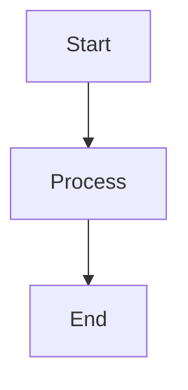

# Test Markdown Documentation

This is a test documentation in Markdown format.

## Introduction

Welcome to the test documentation.

### Overview

A brief overview.

### Goals

The project goals:

- Goal 1
- Goal 2
- Goal 3

## Architecture

The architecture of the system.

### Components

```python
class Component:
    def __init__(self, name):
        self.name = name
```

### Diagrams



## API Reference

### Endpoints

| Method | Path | Description |
|--------|------|-------------|
| GET | /api/users | Get users |
| POST | /api/users | Create user |

### Authentication

Authentication section.

#### API Keys

Use API keys for authentication.

#### OAuth

Use OAuth for web apps.

## Configuration

```yaml
server:
  port: 8080
database:
  host: localhost
```

## Conclusion

End of documentation.
